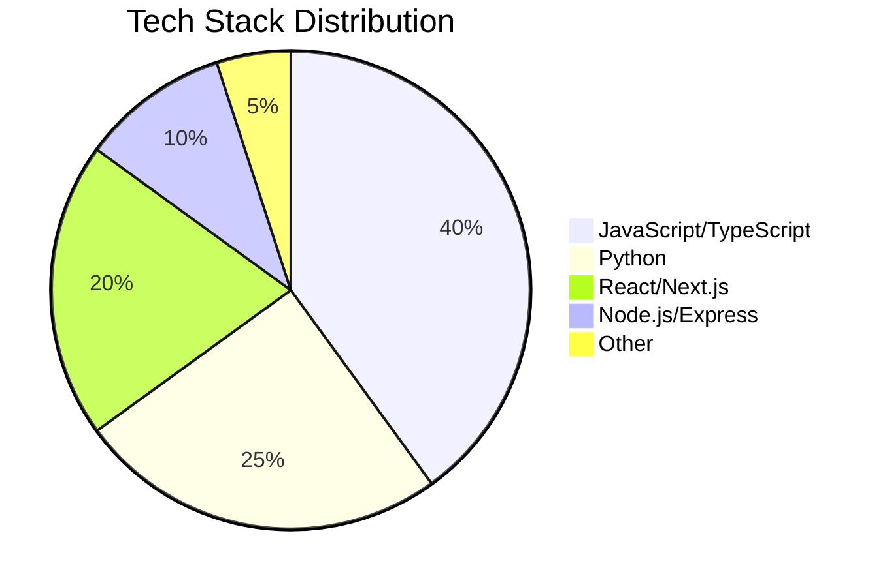

# 🚀 ARYAN PATIL

### Full Stack Developer | AI Enthusiast | Building Tomorrow's Solutions

<div align="center">
  
</div>

---

## 👨‍💻 About Me

<div align="center">
  
</div>

```python
class AryanPatil:
    def __init__(self):
        self.name = "Aryan Patil"
        self.role = "Full Stack Developer"
        self.location = "India 🇮🇳"
        self.education = "Computer Science Engineering"
        self.interests = ["Web Development", "AI/ML", "System Design", "Cloud Computing"]
        self.currently_learning = "Advanced System Architecture"
        self.fun_fact = "I debug with console.log() and pray 🙏"
        self.motto = "Code. Learn. Repeat. 🚀"
    
    def say_hi(self):
        print("Thanks for visiting my GitHub! Let's build something amazing together!")
```

---

## 🚀 Featured Projects

<div align="center">
  
| Project | Tech Stack | Description | Status |
|---------|------------|-------------|--------|
| 🚌 **AI Smart Bus Tracker** | MERN, FastAPI, Python, LangChain, Socket.IO | Real-time bus tracking with AI-powered ETA prediction | 🟢 Live |
| 💰 **PaisaVedh** | MERN, React, Node.js, MongoDB | Full-stack finance management & expense tracking | 🟢 Live |
| 🤖 **AI Interview Platform** | MERN, FastAPI, Python, WebRTC | AI-powered interview with automated evaluation | 🟡 In Progress |
| 🏥 **MediPro** | React, Node.js, Express, MongoDB | Medical inventory management with PDF generation | 🟢 Live |

</div>

---

## 💻 Tech Arsenal

<div align="center">

### 🎨 Frontend Mastery


### ⚡ Backend Power


### 🗄️ Database & Cloud


### 🛠️ Tools & Others


</div>

---

## 📊 GitHub Analytics

<div align="center">
  <a href="https://github.com/aryan-7050">
    
    
  </a>
</div>

<div align="center">
  
</div>

---

## 🏆 Achievements & Contributions

<div align="center">
  
</div>

---

## 📈 Contribution Graph

<div align="center">
  
</div>

---

## 💡 Tech Stack Breakdown

<div align="center">



</div>

---

## 🎯 Current Focus

<div align="center">
  <table>
    <tr>
      <td>📚 Learning</td>
      <td>Advanced System Design & Microservices</td>
    </tr>
    <tr>
      <td>🔭 Building</td>
      <td>AI-powered SaaS Platform</td>
    </tr>
    <tr>
      <td>🤝 Collaborating</td>
      <td>Open Source Projects</td>
    </tr>
    <tr>
      <td>📝 Blogging</td>
      <td>Tech Articles on Medium</td>
    </tr>
  </table>
</div>

---

## 📝 Latest Blog Posts

<div align="center">
  <a href="#">
    
  </a>
  <a href="#">
    
  </a>
  <a href="#">
    
  </a>
</div>

---

## 🤝 Connect With Me

<div align="center">
  
[](https://aryan7050.vercel.app/)
[](https://www.linkedin.com/in/aryan-patil-47b48726b/)
[](https://github.com/aryan-7050)
[](https://twitter.com/aryan_7050)
[](mailto:aryanp7050@gmail.com)

</div>

---

## 🎮 Fun Zone

<div align="center">
  
```text
⚡ Fun fact: I've written more code in the last year than I've slept hours!
🎯 Goal: 1000+ GitHub contributions in 2024
💻 Most used editor: VS Code with the 'SynthWave '84' theme
🎵 Currently jamming to: Lo-fi beats while coding
☕ Coffee dependency: 100% ☕
```

</div>

---

## 📊 Weekly Stats

<div align="center">
  
<!--START_SECTION:waka-->
```text
JavaScript    ████████████░░░░   60.0%
Python        ██████░░░░░░░░░░   30.0%
TypeScript    ████░░░░░░░░░░░░   20.0%
HTML/CSS      ██░░░░░░░░░░░░░░   10.0%
JSON          █░░░░░░░░░░░░░░░    5.0%
```
<!--END_SECTION:waka-->

</div>

---

## 💖 Support My Work

<div align="center">
  
[](https://www.buymeacoffee.com/aryan7050)
[](https://github.com/sponsors/aryan-7050)

</div>

---

<div align="center">
  
</div>

<div align="center">
  
### ⭐ Star some repositories if you find them interesting! ⭐

</div>
